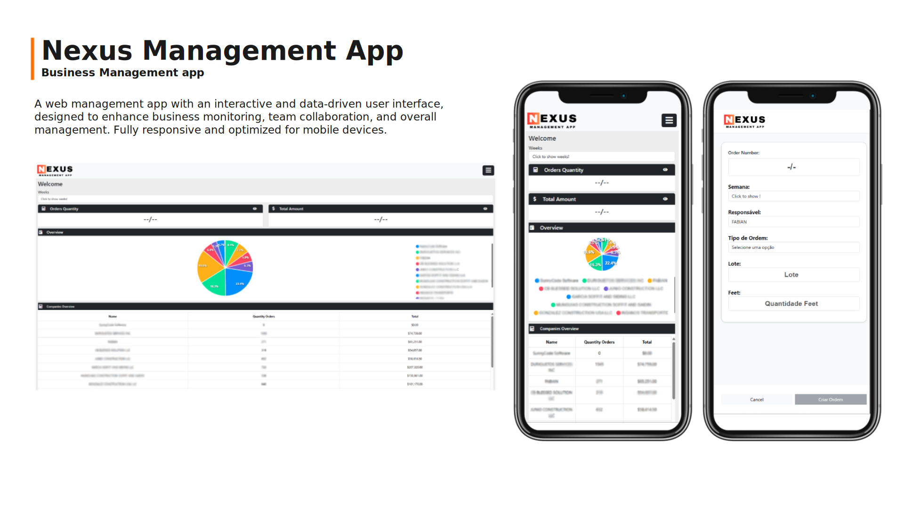
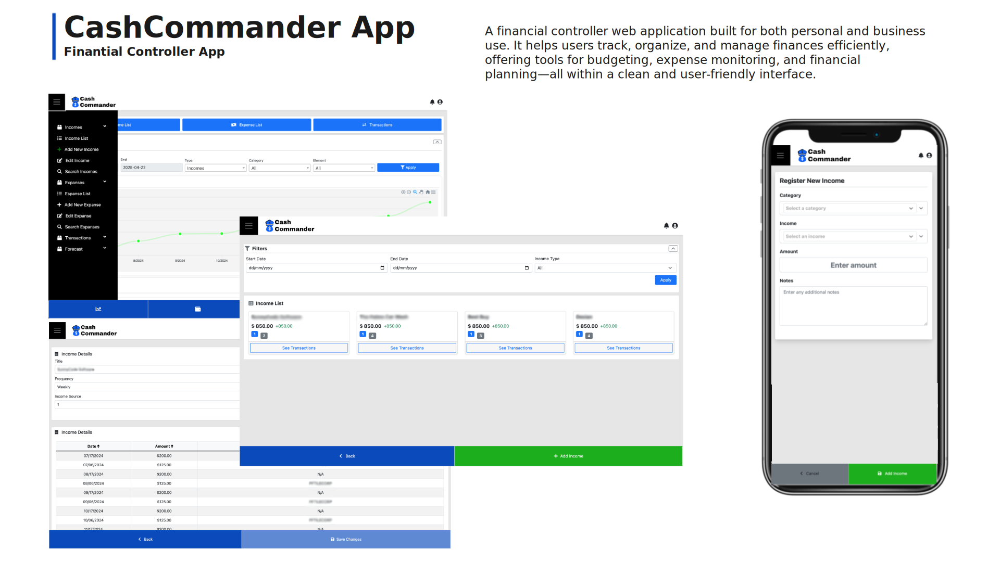
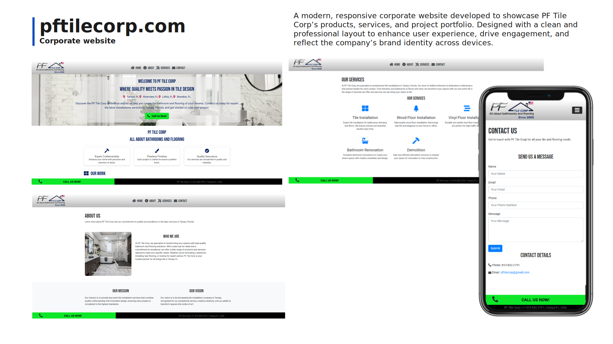

# :sunglasses: Luis Gondim 

Hello! 
I'm Luis Gondim welcome to my software developmet portifolio,

# Contact
(813)465-8235
luis.gondim@sunnycodesoftware.com

# Experience and hands on experience:
Full-Stack Software developer and solution engineer with 7+ years of experience designing and developing software solutions in all software development lifecycle to improve and organize business proccesses.

# Services Catalog

- **Business & Systems Process Optimization**  
  Enhancing organizational efficiency by streamlining workflows and automating processes through tailored software solutions.

- **Full-Stack Software Development**  
  Comprehensive development services covering user interface and experience design, RESTful API integration, microservices architecture, and scalable backend systems.

- **System Administration & Monitoring**  
  Provisioning, maintaining, and monitoring IT infrastructure to ensure system reliability, performance, and minimal downtime.

- **Cybersecurity**  
  Implementing secure software development practices, identity and access management, and system hardening to protect digital assets and ensure compliance with security standards.

- **Cloud Computing**  
  Designing, deploying, and managing cloud-based solutions using Microsoft Azure to enable scalability, resilience, and operational agility.

- **IT Infrastructure Administration**  
  Configuring, supporting, and optimizing both on-premises and virtual infrastructure to meet business and technical requirements effectively.

# Technologies

- **Programming Languages**: C#, JavaScript, HTML5, CSS3, SQL
- **Frameworks & Platforms**: .NET Core, ASP.NET MVC, Entity Framework, Bootstrap
- **Frontend Development**: Razor Pages, Bootstrap 5, jQuery
- **Backend & APIs**: RESTful API Development, MySQL, LINQ, Identity Framework
- **Cloud & Infrastructure**: Microsoft Azure (App Services, SQL Database, Blob Storage, Virtual Machines)
- **Authentication & Security**: Microsoft Entra ID (Azure AD), Role-Based Access Control (RBAC), OAuth 2.0
- **Version Control & CI/CD**: GitHub, Git, GitHub Actions
- **Project Management & DevOps**: Azure DevOps, Visual Studio, Postman

# Portifolio: 

# Nexus Management App
A modern web application designed to support business management by enabling companies to streamline operations, gain actionable insights, and visualize data through an intuitive and interactive user interface.

Image:

Technology: .NET Core and MySQL, Javascript

# CashCommander App (BETA) 
A financial controller web application built for both personal and business use. It helps users track, organize, and manage finances efficiently, offering tools for budgeting, expense monitoring, and financial planning—all within a clean and user-friendly interface.

Image:

Technology: .NET Core and MySQL, Javascript

# PfTileCorp.com (Corporate Website)
**Link: www.pftilecorp.com**
A modern, responsive corporate website developed to showcase PF Tile Corp’s products, services, and project portfolio. Designed with a clean and professional layout to enhance user experience, drive engagement, and reflect the company’s brand identity across devices.

Image:

Technology: .NET Core and MySQL, Javascript

