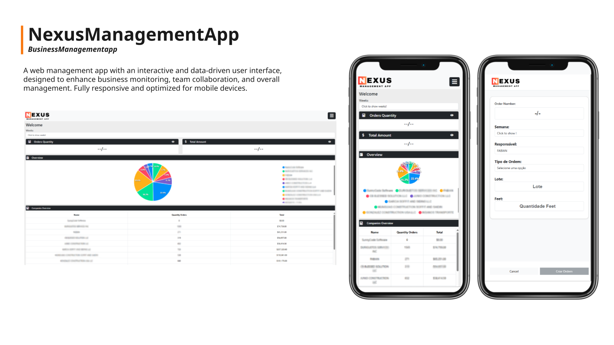
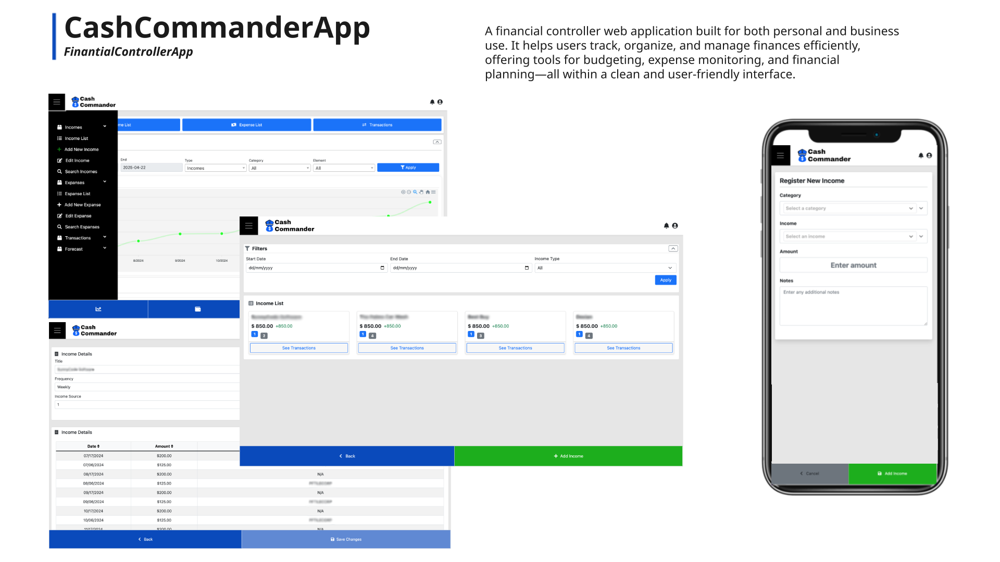
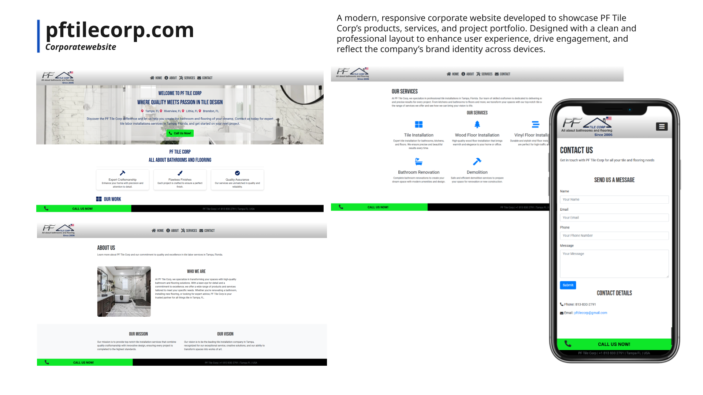

# Luis Gondim

**Full-Stack Software Engineer | C# / .NET | React | Enterprise Web Applications**

I am a software engineer with 7+ years of experience designing, developing, modernizing, and supporting enterprise web applications, REST APIs, database-driven systems, and business workflow platforms.

My core technical stack includes C#, .NET, ASP.NET Core, React, JavaScript, SQL Server, MySQL, and Microsoft Azure. I work across the full Software Development Life Cycle (SDLC), including frontend development, backend API design, database modeling, authentication, deployment, troubleshooting, documentation, and production support.

I focus on building practical software systems that help businesses organize operations, automate workflows, improve visibility, and replace manual processes with reliable web-based applications.

---

## Contact

- Email: lpaulogondim@gmail.com
- Phone: (813) 465-8235
- LinkedIn: https://www.linkedin.com/in/luispaulogondim/

---

## Technical Focus

* Full-stack enterprise web application development using React, C#, .NET, and ASP.NET Core
* REST API design, backend services, DTOs, service layers, repositories, and structured application architecture
* Frontend development using React, JavaScript, TypeScript, HTML, CSS, Bootstrap, AG Grid, and reusable UI components
* Database-driven application design using SQL Server, MySQL, Entity Framework Core, LINQ, stored procedures, and query optimization
* Business workflow systems for orders, invoices, service requests, dashboards, customer records, reporting, and operational processes
* Authentication and authorization using ASP.NET Identity, JWT, RBAC, OAuth 2.0, and Microsoft Entra ID
* Cloud deployment and DevOps using Microsoft Azure, Azure App Service, GitHub Actions, Azure DevOps, CI/CD pipelines, and Git workflows
* Production support, debugging, troubleshooting, performance diagnostics, technical documentation, and system modernization
* Code review, technical analysis, issue investigation, and evaluation of software quality, maintainability, and reliability

---

## Technologies

### Frontend Development
React, JavaScript, TypeScript, HTML5, CSS3, Bootstrap 5, Razor Pages, jQuery, AG Grid

### Backend Development
C#, .NET, .NET Core, ASP.NET Core, ASP.NET MVC, ASP.NET Core Web API, REST APIs, Entity Framework Core, LINQ, ASP.NET Identity

### Databases
SQL Server, MySQL, Azure SQL Database, Stored Procedures, Database Design, Data Modeling, Query Optimization

### Cloud & DevOps
Microsoft Azure, Azure App Service, Azure Blob Storage, Azure Virtual Machines, GitHub Actions, Azure DevOps, CI/CD, Docker

### Tools
Visual Studio, VS Code, Git, GitHub, Postman, Azure Portal, Jira

---

## Featured Projects

### Nexus Management App

A web-based management application designed for construction and service-oriented business clients. The system helps companies manage orders, customers, service requests, operational workflows, reporting, and business records through a structured web platform.

**Technical highlights:**

- Designed and developed web application modules using React, .NET, C#, MySQL, JavaScript, and Bootstrap
- Built frontend screens for managing business workflows, records, and operational data
- Developed backend APIs and database logic to support order management and reporting
- Created structured UI layouts focused on usability, productivity, and business operations
- Supported application troubleshooting, data validation, and feature improvements

---

### CashCommander App

A financial management web application built for personal and small business use. The application helps users organize income, expenses, budgets, financial activity, and planning through a clean and user-friendly interface.

**Technical highlights:**

- Built with .NET Core, C#, MySQL, JavaScript, and Bootstrap
- Developed user-facing web screens for financial tracking and record management
- Designed database structures for financial data
- Created workflows for expense tracking, budgeting, and financial organization
- Focused on clean UI, practical usability, and structured business logic

---

### PF Tile Corp Website

A responsive business website developed for PF Tile Corp to present services, company information, and project portfolio content in a professional way.

**Live website:** www.pftilecorp.com

**Technical highlights:**

- Designed and developed responsive website pages using modern web technologies
- Built service sections, contact flow, and business presentation pages
- Improved mobile usability, page structure, and professional branding
- Created a clean layout focused on user experience and service visibility

---

## Additional Project Experience

### UOS / Silver Trend

Enterprise construction operations platform involving order management, dispatch workflows, invoice processing, subcontractor assignment, material tracking, reporting, filtering, pagination, and PDF generation.

**Technical highlights:**

- Developed enterprise web application modules using React, C#, ASP.NET Core Web API, SQL/MySQL, and AG Grid
- Built frontend components for forms, filters, data grids, modals, dashboards, and operational workflows
- Created backend APIs, DTOs, services, repositories, validation logic, and database integration
- Supported authentication, authorization, JWT/RBAC, production troubleshooting, and system modernization

---

### VP 11 Credential Sharing

Credential-sharing and access workflow project involving secure user access, application logic, validation, and troubleshooting.

**Technical highlights:**

- Supported web application functionality using C#, .NET, REST APIs, SQL, and authentication-related workflows
- Worked on backend logic, access control behavior, validation, and API communication
- Assisted with troubleshooting and improving reliability for user access workflows

---

## What I Build

* Enterprise web applications
* Internal business systems
* Customer portals
* Order management systems
* Invoice and reporting modules
* Dashboard and data grid interfaces
* REST API integrations
* Workflow automation tools
* Database-driven web platforms
* Cloud-hosted business applications
* Production support tools and operational software

---

## Current Focus

I am currently focused on **AI Engineering and Software Engineering**, combining full-stack development experience with practical AI adoption in modern software systems.

My work focuses on building enterprise-style web applications using **React, C#, .NET, ASP.NET Core, SQL, Azure, LLM-based tools, AI-assisted development workflows, and modern UI patterns**.

I am especially interested in how software engineers are adapting to AI through **Large Language Models (LLMs), prompt engineering, AI-assisted coding, code generation, retrieval-augmented generation (RAG), API-based AI integrations, automation workflows, intelligent developer tools, and AI-powered application features**.

I am also expanding my experience in evaluating AI-generated code, analyzing technical responses, reviewing model reasoning, improving code quality, debugging complex issues, documenting systems, and using AI tools to support software design, refactoring, testing, and development productivity.

My goal is to continue growing as a full-stack software engineer with strong experience in **AI-assisted software development, LLM-based engineering workflows, enterprise applications, frontend development, backend APIs, database design, production support, technical documentation, and software systems that solve real operational problems**.

